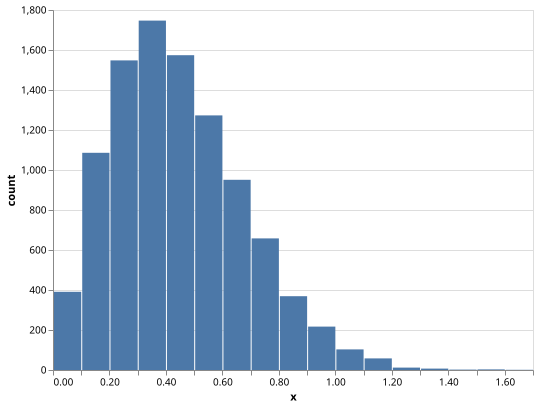

# cl-ceigen-lite

[C2FFI](https://github.com/rpav/c2ffi/) / [cl-autowrap](https://github.com/rpav/cl-autowrap) based wrapper for [ceigen_lite](https://github.com/digikar99/ceigen_lite).

This project has been to put to use in [numericals](https://github.com/digikar99/numericals).

<!-- markdown-toc start - Don't edit this section. Run M-x markdown-toc-refresh-toc -->
**Table of Contents**

- [ceigen](#ceigen)
- [ceigen-rand](#ceigen-rand)
    - [Set seed](#set-seed)
    - [Floating point distributions](#floating-point-distributions)
    - [Integer distributions](#integer-distributions)

<!-- markdown-toc end -->


## ceigen

Undocumented. See [ceigen\_lite/ceigen\_lite.h](./ceigen_lite/ceigen_lite.h) for a list of functions.

## ceigen-rand

Lightweight wrapper around random number generators of ceigen-lite. These functions are not thread safe. Use reentrant `*-r` versions of functions in ceigen-lite to write your own. Refer to [EigenRand](https://bab2min.github.io/eigenrand/v0.6.0.rc2/en/list_of_supported_distribution.html) for documentation.

Function names ending with a bang `!` take a preallocated vector as the first argument. Those that do not end with a bang take the length of vector as the first argument.

### Example

```lisp
CL-USER> (ceigen-rand:normal 10)
#(-0.3159488447867161d0 -0.5103018840923546d0 1.5746371159773929d0 -0.1610542707259238d0 -1.9752287035350389d0 1.4105009947705465d0 0.5924859744718102d0 2.063059520011821d0 -0.033612101055019675d0 1.049602195711758d0)
CL-USER> (ceigen-rand:normal 10 10) ; mean
#(11.874658470078678d0 11.760088953409308d0 9.703621534235378d0 9.985451322015217d0 10.4851009863238d0 10.303545011213409d0 11.130584480697577d0 10.15124776941885d0 10.588566360152816d0 9.554090457296223d0)
CL-USER> (ceigen-rand:normal 10 10 10) ; mean and stdev
#(16.706110262871455d0 12.803837426736342d0 4.160216302016946d0 19.739792804976126d0 3.337840680144046d0 0.10632964227771069d0 -3.8717394553659723d0 5.031785144682033d0 14.313258033370634d0 0.7000576745471232d0)
CL-USER> (ceigen-rand:normal 10 10 10 'single-float) ; mean, stdev, array element type
#(6.4593744 2.0928864 0.9040985 9.690875 -10.680683 17.281898 15.900239 -6.0028687 11.017324 11.499055)
CL-USER> (ceigen-rand:normal! (make-array 100 :element-type 'single-float)
                              10
                              10)
#(11.205253 17.197838 3.8246212 20.006351 9.031726 19.425741 8.880972 14.435491 -2.3432007 23.579283 ...)
```

Plot using [cl-vega-lite](https://github.com/digikar99/cl-vega-lite).

```lisp
(vega-lite:histogram (ceigen-rand:weibull 10000 2 0.5) :step 0.1)
```

<p align="center" width="100%">
    
</p>

### Set seed

- seed

### Floating point distributions

- beta
- beta!
- cauchy
- cauchy!
- chi-squared
- chi-squared!
- exponential
- exponential!
- extreme-value
- extreme-value!
- fisher-f
- fisher-f!
- gamma
- gamma!
- lognormal
- lognormal!
- normal
- normal!
- uniform-real
- uniform-real!
- weibull
- weibull!

### Integer distributions

These only support (signed-byte 32) given EigenRand's limitations.

- bernoulli
- bernoulli!
- binomial
- binomial!
- geometric
- geometric!
- negative-binomial
- negative-binomial!
- poisson
- poisson!
- uniform-int
- uniform-int!
